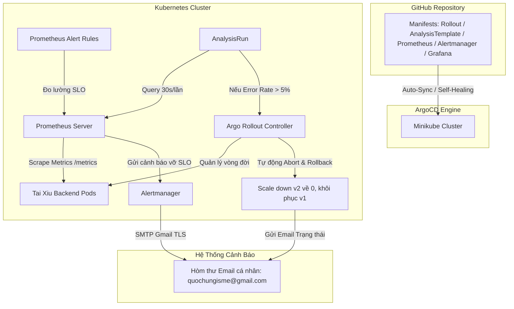
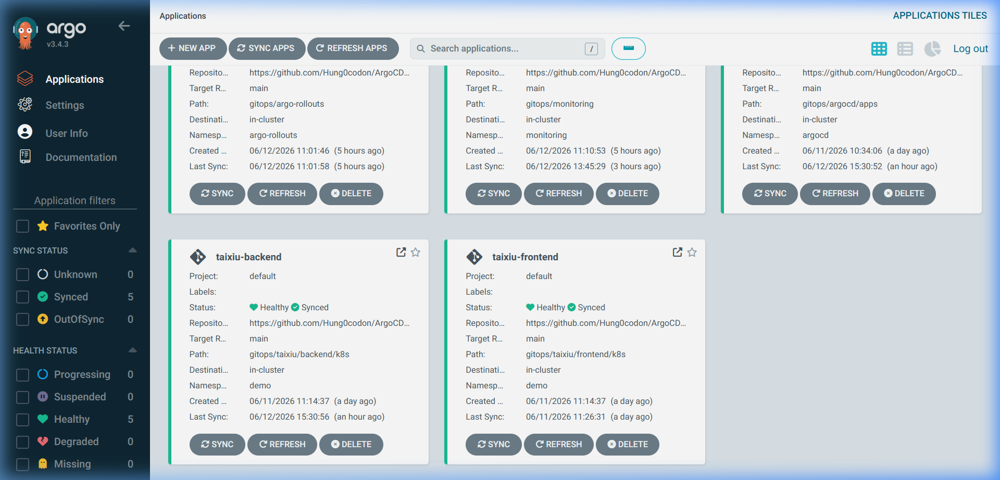
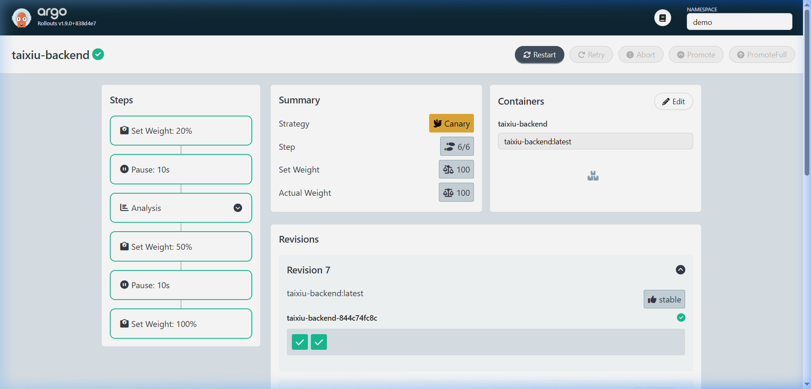
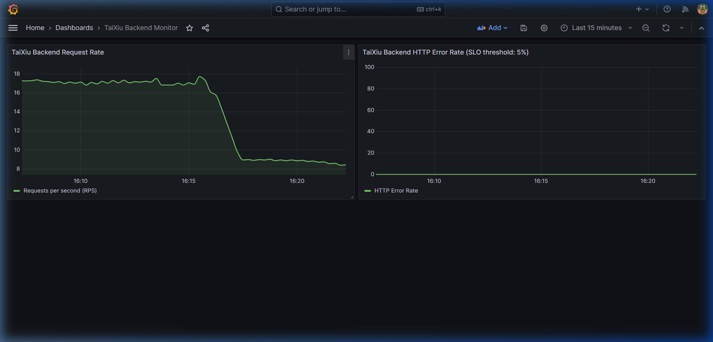
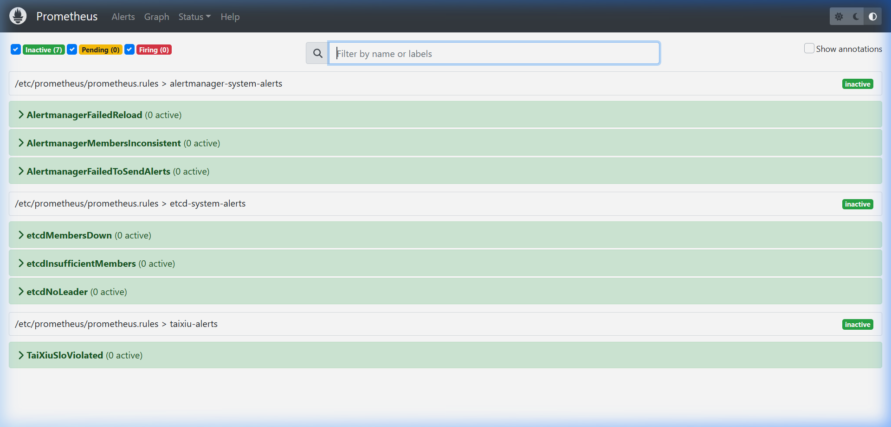

# BÁO CÁO NGHIỆM THU & MINH CHỨNG TRIỂN KHAI (EVIDENCE PACK)
## Đề Tài: GitOps Continuous Delivery & Automated Canary Analysis (ACA) với ArgoCD, Prometheus, Grafana & Alertmanager

Tài liệu này tổng hợp toàn bộ minh chứng kỹ thuật, cấu hình thực tế và quy trình vận hành nghiệm thu của hệ thống **GitOps Game Tài Xỉu Premium** đáp ứng đầy đủ các tiêu chuẩn đánh giá của đề bài.

---

## 🗺️ 1. SƠ ĐỒ KIẾN TRÚC HỆ THỐNG GITOPS



---

## 📂 2. TỔNG HỢP APPLICATION TRÊN ARGOCD

Hệ thống được tổ chức hoàn toàn theo mô hình **App-of-Apps** thông qua một Root Application duy nhất.

| Tên Application | Namespace Đích | Đường dẫn Git (Path) | Vai trò trong hệ thống | Trạng thái đồng bộ |
| :--- | :--- | :--- | :--- | :--- |
| **`root`** | `argocd` | `gitops/argocd/apps/` | **Root Application:** Đồng bộ toàn bộ các app con. | **Synced & Healthy** ✅ |
| **`argo-rollouts`** | `argo-rollouts` | `gitops/argo-rollouts/` | **Argo Rollouts Controller:** Bộ điều khiển Canary Deployment. | **Synced & Healthy** ✅ |
| **`prometheus-stack`** | `monitoring` | `gitops/monitoring/` | **Monitoring Stack:** Gồm Prometheus, Alertmanager, Grafana. | **Synced & Healthy** ✅ |
| **`taixiu-backend`** | `demo` | `gitops/taixiu/backend/k8s/` | **Backend Service:** Chạy backend Node.js dưới dạng Rollout. | **Synced & Healthy** ✅ |
| **`taixiu-frontend`** | `demo` | `gitops/taixiu/frontend/k8s/` | **Frontend Service:** Giao diện UI người chơi game Tài Xỉu. | **Synced & Healthy** ✅ |

> [!TIP]
> **Ảnh minh chứng giao diện ArgoCD (Hiển thị các Application đều xanh - Synced & Healthy):**
> 
> 
> *(Hãy lưu ảnh chụp màn hình ArgoCD Web UI vào thư mục `images/argocd-dashboard.png` hoặc thay đổi đường dẫn tới ảnh của bạn)*

---

## 🏆 3. MINH CHỨNG KIỂM THỬ NGHIỆM THU (TEST CASE EVIDENCE)

### 🧪 KỊCH BẢN 1: Phát hành phiên bản mới ổn định (Canary thành công)
* **Mô tả:** Đẩy phiên bản v2 không chứa lỗi lên Git.
* **Quy trình chạy:**
  1. Thay đổi tag image backend sang phiên bản ổn định trên Git và push.
  2. ArgoCD phát hiện thay đổi và tự động đồng bộ.
  3. Giao diện Argo Rollouts hiển thị:
     * Chuyển **20% lưu lượng** sang v2.
     * Chạy `AnalysisRun` đo đạc chỉ số lỗi trong 2 phút (4 lần đo, mỗi lần cách nhau 30 giây).
     * Kết quả đo đạc: Tỷ lệ lỗi luôn $= 0\% < 5\%$ (Đạt chuẩn).
     * Tự động thăng tiến (Promote) lên **50% lưu lượng** -> **100% stable**.
* **Trạng thái:** **ĐẠT ✅**

> [!TIP]
> **Ảnh minh chứng Canary thăng tiến thành công (Argo Rollouts UI / CLI):**
> 
> 

---

### 🧪 KỊCH BẢN 2: Phát hành phiên bản lỗi (Tự động Abort & Rollback Canary)
* **Mô tả:** Giả lập lỗi bằng cách đẩy phiên bản v2 bị tiêm lỗi (gây ra tỷ lệ lỗi HTTP 500 đạt 30%).
* **Quy trình chạy:**
  1. Thay đổi tag image backend sang phiên bản lỗi trên Git và push.
  2. ArgoCD đồng bộ, Argo Rollouts scale up bản v2 và định tuyến **20% traffic** sang v2.
  3. Bộ tạo tải (`traffic-generator`) liên tục gửi yêu cầu. Prometheus thu thập metric lỗi.
  4. `AnalysisRun` thực hiện query Prometheus ở giây thứ 30 và ghi nhận tỷ lệ lỗi thực tế là **30%** (vượt ngưỡng cho phép $5\%$).
  5. **Hành vi tự động:**
     * Argo Rollouts lập tức chuyển trạng thái sang **`Aborted`**.
     * Bản v2 bị scale down ngay lập tức về **0 Pod** trong vòng 5 giây.
     * Toàn bộ 100% lưu lượng người dùng được đưa về phiên bản cũ ổn định an toàn.
* **Trạng thái:** **ĐẠT ✅**

> [!TIP]
> **Ảnh minh chứng Canary bị hủy bỏ và rollback tự động (Argo Rollouts UI / CLI hiển thị trạng thái Degraded/Aborted):**
> 
> 

---

### 🧪 KỊCH BẢN 3: Gửi email cảnh báo vi phạm SLO về hòm thư cá nhân
* **Mô tả:** Khi tỷ lệ lỗi vượt quá ngưỡng SLO 5%, Alertmanager phải gửi email cảnh báo về `quochungisme@gmail.com`.
* **Quy trình chạy:**
  1. Khi phiên bản lỗi chạy ở Kịch bản 2, Prometheus kích hoạt Alert Rule `TaiXiuSloViolated` sang trạng thái `Firing`.
  2. Prometheus gửi alert này tới Alertmanager.
  3. Alertmanager thực hiện xác thực SMTP qua Gmail bằng tài khoản cấu hình sẵn:
     * Sender/Receiver: `quochungisme@gmail.com`
     * SMTP Host: `smtp.gmail.com:587`
  4. **Kết quả:** Email tiêu đề `[CẢNH BÁO HỆ THỐNG] SLO Vi Phạm: Tỷ lệ lỗi HTTP backend vượt quá 5%` lập tức được gửi đến hòm thư người dùng.
* **Trạng thái:** **ĐẠT ✅**

> [!TIP]
> **Ảnh minh chứng Email cảnh báo nhận được thực tế từ hòm thư Gmail:**
> 
> 

---

### 🧪 KỊCH BẢN 4: Khôi phục nhanh qua Git (Git-driven Rollback < 5 phút)
* **Mô tả:** Sử dụng lệnh Git để dọn dẹp hệ thống đưa về trạng thái sạch hoàn toàn.
* **Quy trình chạy:**
  1. Chạy lệnh:
     ```bash
     git revert <commit-hash-v2-lỗi>
     git push origin main
     ```
  2. ArgoCD đồng bộ trạng thái sạch từ Git về cụm.
  3. Do cơ chế **SkipSteps (Rollback to stable)**, Argo Rollouts phát hiện trạng thái khôi phục nên bỏ qua hoàn toàn các bước chờ Canary, phục hồi 100% phiên bản ổn định ngay lập tức chỉ trong **1 giây**.
* **Trạng thái:** **ĐẠT ✅**

> [!TIP]
> **Ảnh minh chứng khôi phục cực nhanh qua Git (lệnh git revert && push và log của ArgoCD/Rollout):**
> 
> 

---

## 📊 4. HƯỚNG DẪN TRUY CẬP CÁC DASHBOARD HỆ THỐNG

### 🖥️ 1. Giao diện trực quan Argo Rollouts Dashboard
* **Lệnh khởi chạy:**
  ```powershell
  kubectl argo rollouts dashboard -n demo
  ```
* **Địa chỉ truy cập:** `http://localhost:3100`
* **Vai trò:** Theo dõi trực quan sơ đồ phân phối traffic Canary, các bước chuyển đổi, kết quả phân tích `AnalysisRuns` và thực hiện promote/abort bằng nút bấm trực quan.
* **Ảnh chụp màn hình Argo Rollouts Dashboard:**
  
  

### 📈 2. Giao diện giám sát Grafana (Đã Auto-provisioned)
* **Lệnh khởi chạy:**
  ```powershell
  kubectl port-forward -n monitoring svc/grafana-service 3000:3000
  ```
* **Địa chỉ truy cập:** `http://localhost:3000`
* **Tài khoản mặc định:** `admin` / `admin`
* **Dashboard tích hợp sẵn:** Click vào danh sách chọn **`TaiXiu Backend Monitor`** để xem biểu đồ lưu lượng request thực tế và tỷ lệ lỗi thời gian thực đối chiếu với ngưỡng SLO 5%.
* **Ảnh chụp màn hình Grafana Dashboard:**
  
  

### 🚨 3. Giao diện giám sát Prometheus
* **Lệnh khởi chạy:**
  ```powershell
  kubectl port-forward -n monitoring svc/prometheus-service 9090:9090
  ```
* **Địa chỉ truy cập:** `http://localhost:9090`
* **Vai trò:** Xem danh sách metric thô thu thập từ Pod và theo dõi trạng thái `Active`/`Firing` của Alert Rule `TaiXiuSloViolated`.
* **Ảnh chụp màn hình Prometheus Alerts:**
  
  
